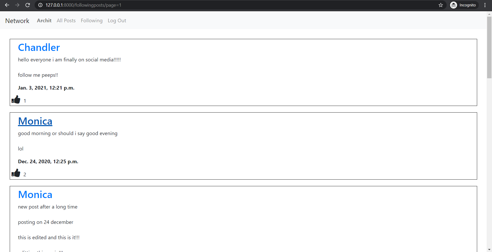
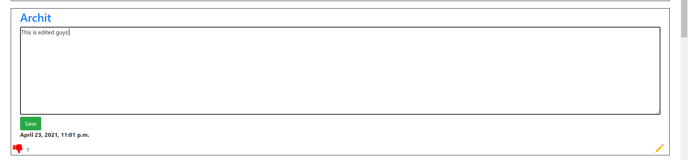

# Network (A social media website)

### Description
This is a social networking website created in **Python(Django)** and **Javascript**.  
Here you can post anything you like you just have to make an account, you can also follow other people you like and also like the posts you like.  
You can also edit your posts by clicking the pencil icon appearing on your own posts.
***
### Features
1. Register:
To use this website you have to register/make and account so you can go on the register link to register yourself on this website.

   
2. Login:
If you want to use most of the features of this website you have to login with the account you made using the above register link.

   
3. Allposts:
Without Login:  
You can see the posts but you cannot follow or post anything new on this website.
.png)
   
With Login:  
You can Post new post and see the posts of all the people on this website.
.png)
2.png)

4. Following:
Here posts from those people appear those you have been following.


   
5. Profile:
Your Profile:
Here you can see your own profile and can also see the number of following, followers and can see all the posts you have created till date.

   
Other users Profile:
Here you can visit to follow or un-follow the other users and also see the number of followers and following of that user.


6. Edit:
You can Edit your posts by clicking the pencile icon appearing on your posts.


7. Pagination:
On all those pages where the posts are being displayed there is pagination applied you as for smooth working of the website.
On each page you can see the 10 posts at max, you can enter a number to skip to that page number.
   
***   
### How To Run
```bash
python manage.py runserver
```
***
### Video 
[Network](https://www.youtube.com/watch?v=H4VTxlGEkXU)
